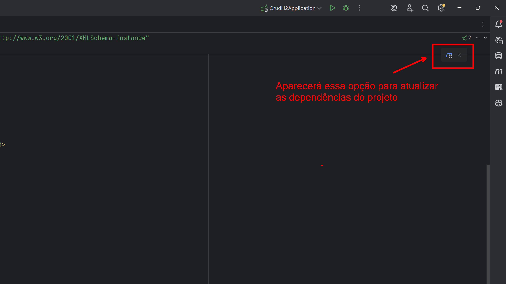
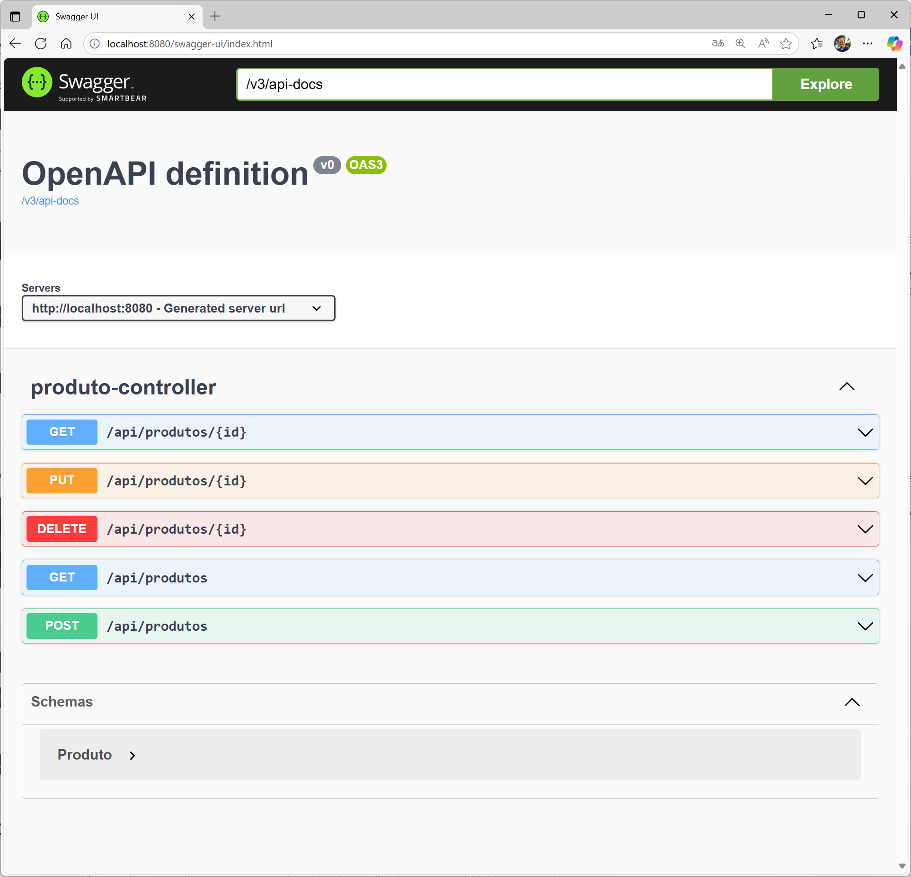
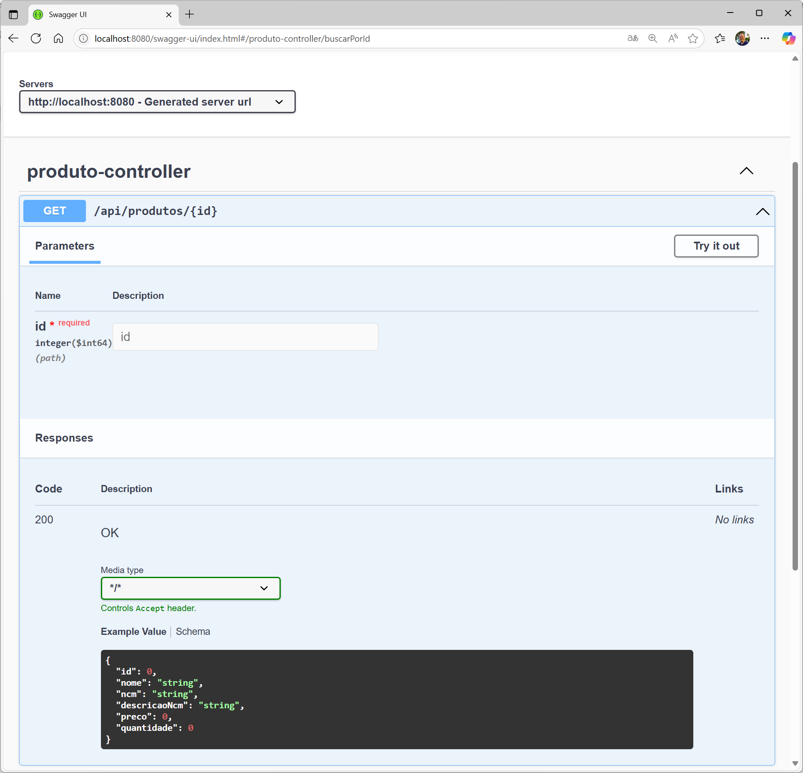
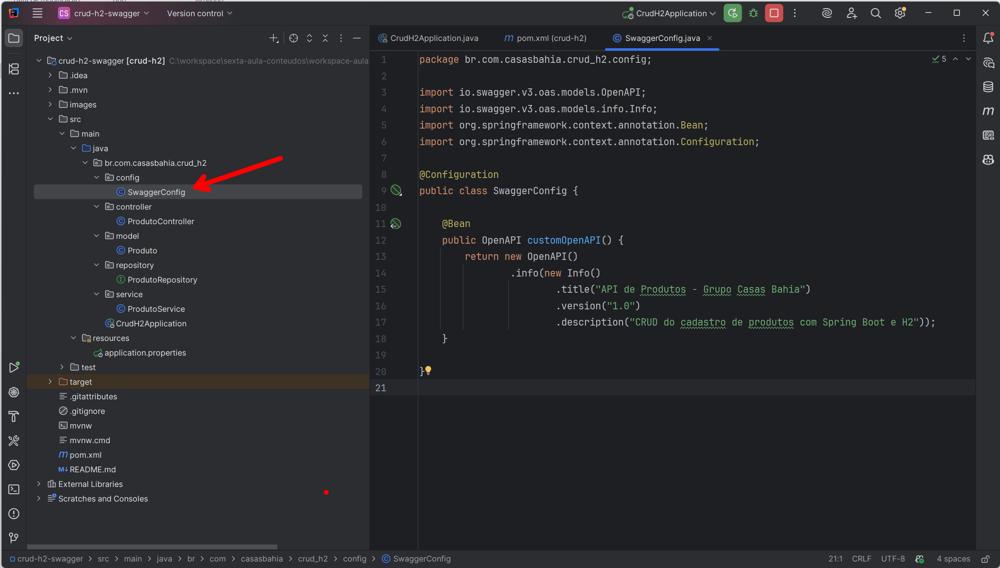
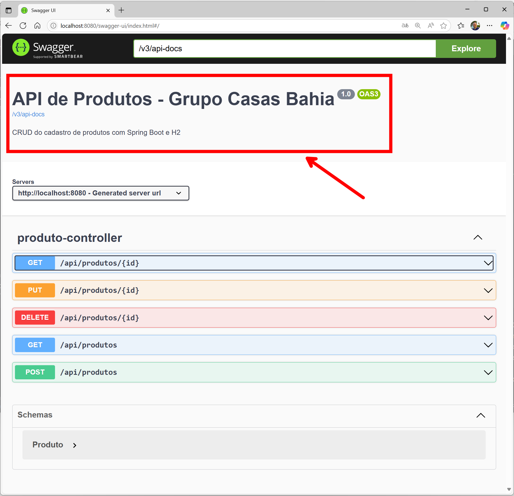
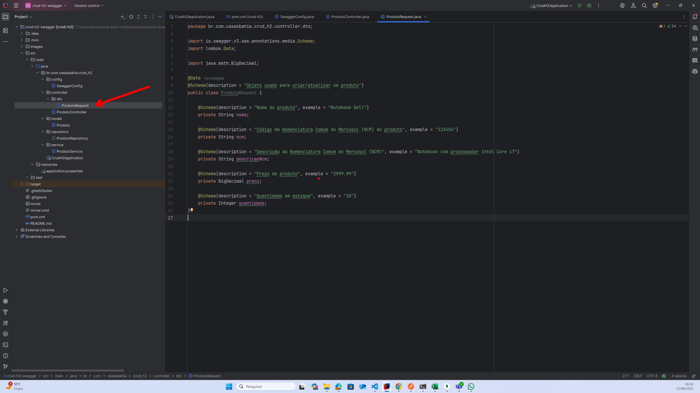
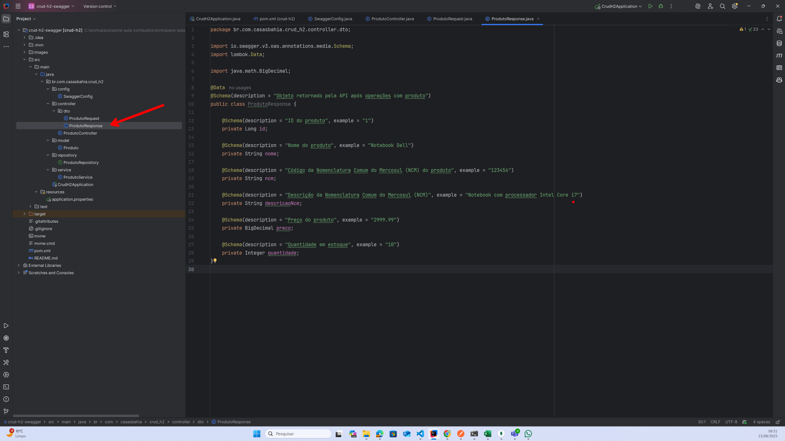
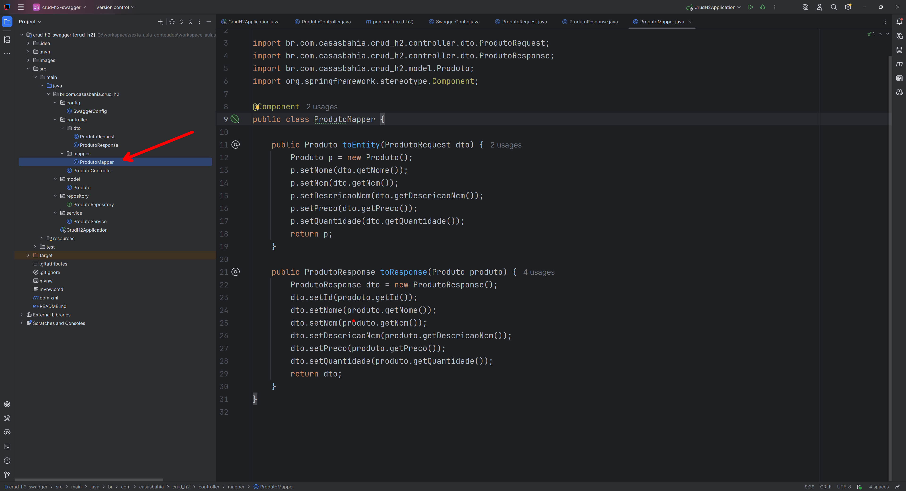
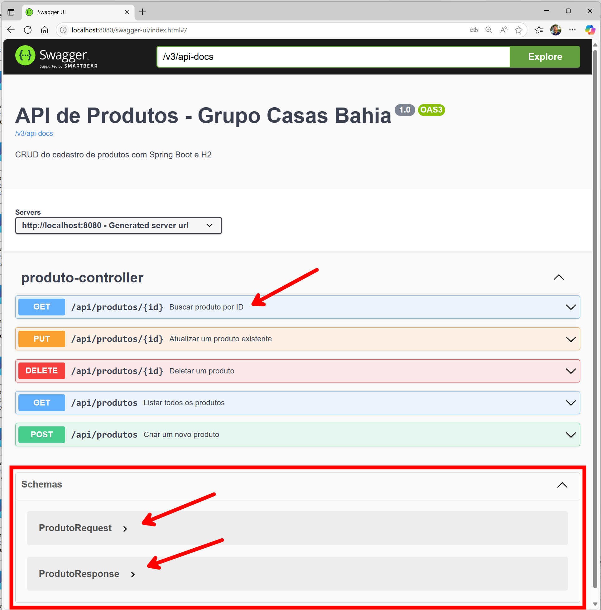

# 🛠 Documentação de projetos no Spring Boot


O objetivo desta aula é mostrar como configurar **Swagger UI** usando **Springdoc OpenAPI** no **Spring Boot** para documentar e testar sua API de forma simples.


---


## 1️⃣ O que é Swagger e OpenAPI 📖

### 🧭 Swagger

O **Swagger** começou como um **conjunto de ferramentas** para **descrever, gerar e consumir APIs REST**.

Hoje, o nome é usado principalmente para se referir a:

* **Swagger UI** → Interface web para visualizar e testar endpoints de uma API.
* **Swagger Editor** → Editor online para criar/manipular especificações.
* **Swagger Codegen** → Gera código cliente e servidor a partir de uma especificação.

> 💡 **Importante:** O formato de descrição que o Swagger usava evoluiu para se tornar o **OpenAPI Specification (OAS)**, mantido agora pela **OpenAPI Initiative**.


### 📜 OpenAPI

O **OpenAPI Specification (OAS)** é um **padrão** para **descrever APIs REST**.

Funciona como um **contrato** que define:

* 📍 **Endpoints** (ex.: `/api/produtos`)
* 🔄 **Métodos HTTP** (`GET`, `POST`, `PUT`, `DELETE`)
* 📨 **Parâmetros de entrada**
* 📦 **Estrutura das respostas**
* 🛑 **Códigos de status**

Pode ser escrito em **JSON** ou **YAML**.


* 📝 Exemplo simples em YAML

    ```yaml
    openapi: 3.0.3
    info:
    title: API de Produtos
    version: 1.0.0
    paths:
    /produtos:
        get:
        summary: Lista todos os produtos
        responses:
            '200':
            description: Lista retornada com sucesso
    ```


### 🛠 Springdoc OpenAPI

O **Springdoc OpenAPI** é uma biblioteca que simplifica a integração do Spring Boot com o OpenAPI. Ele gera automaticamente a documentação da API com base nas anotações do Spring e fornece uma interface Swagger UI para testar os endpoints.


### 💡 Resumo da relação

* 📜 **OpenAPI** → É o **padrão** (especificação).
* 🧭 **Swagger** → É o **conjunto de ferramentas** que implementa e facilita trabalhar com o padrão OpenAPI.
* ⚙️ **Springdoc OpenAPI** → É a **biblioteca** que integra Spring Boot e OpenAPI (e geralmente embute o Swagger UI).


### 🗓️ Linha do tempo resumida — Swagger e OpenAPI

* **2010 – Nasce o Swagger**

    * Criado por **Tony Tam**, o Swagger definia sua **própria especificação** para documentar APIs REST.
    * Junto com a especificação, foram criadas ferramentas como:

        * **Swagger UI**
        * **Swagger Editor**
        * **Swagger Codegen**

* **2015 – OpenAPI Initiative**

    * A especificação do Swagger foi **doada para a Linux Foundation** e se tornou **OpenAPI Specification (OAS)**.
    * A partir daí, o termo “Swagger” passou a se referir **apenas às ferramentas** e **não mais ao padrão**.


* **Hoje**

    * **Swagger** = Ferramentas (**UI, Editor, Codegen**)
    * **OpenAPI** = Padrão (**formato de contrato da API**)
    * No dia a dia, muitos devs ainda dizem **“Swagger”** para se referir à documentação, mesmo quando tecnicamente é **OpenAPI**.


💡 Ao adicionar essa dependência ao projeto, o **Springdoc OpenAPI** automaticamente configura e disponibiliza a documentação da sua API. Com isso, tanto o **gerador de especificação OpenAPI** quanto a interface interativa do **Swagger UI** estarão prontos para uso, sem necessidade de configurações adicionais.


## 2️⃣ ⚙️ Configurando o Springdoc OpenAPI no projeto

Vamos usar como ponto de partida o projeto de CRUD implementado na Aula 1 como base para adicionar a documentação da API.


* **Aula 1: CRUD com Spring Boot**
    - Disponível em https://github.com/alonsodecarli-via/crud-h2


* 📥 **Adicionando a dependência no projeto:**

    * No arquivo `pom.xml` do seu projeto, adicione:

        ```xml
        <dependency>
            <groupId>org.springdoc</groupId>
            <artifactId>springdoc-openapi-starter-webmvc-ui</artifactId>
            <version>2.5.0</version>
        </dependency>
        ```

        

    * Observe que aparecerá um ícone de **atualização de dependências do maven** no canto esquerdo do IntelliJ, dando uma opção de baixar a dependência, no projeto.

        


💡 Com essa dependência adicionada ao projeto, **o gerador OpenAPI** e **o Swagger UI** estão disponíveis para uso.


---


## 3️⃣ 🌐 Acessando a documentação

Com a aplicação em execução, abra o navegador e acesse:

```
http://localhost:8080/swagger-ui/index.html
```

Será exibida a **interface interativa do Swagger UI**, onde é possível:

* 🔍 Visualizar todos os endpoints disponíveis.
* 📄 Consultar detalhes de cada rota (método HTTP, parâmetros, modelos de entrada e saída).
* ▶️ Executar chamadas diretamente na interface para testar o funcionamento da API.

    

    


---

## 4️⃣ 🎨 Personalizando informações da API

Para personalizar as informações exibidas na documentação, como título, descrição e versão da API, você pode criar uma classe de configuração.

* **Criando uma classe de configuração**:

    ```java
    package br.com.casasbahia.crud_h2.config;

    import io.swagger.v3.oas.models.OpenAPI;
    import io.swagger.v3.oas.models.info.Info;
    import org.springframework.context.annotation.Bean;
    import org.springframework.context.annotation.Configuration;

    @Configuration
    public class SwaggerConfig {

        @Bean
        public OpenAPI customOpenAPI() {
            return new OpenAPI()
                    .info(new Info()
                            .title("API de Produtos - Grupo Casas Bahia")
                            .version("1.0")
                            .description("CRUD do cadastro de produtos com Spring Boot e H2"));
        }

    }
    ```

    


    * Rodando a aplicação novamente, você verá que as informações da API foram atualizadas na interface do Swagger UI:

    


    * 📚 **Anotação @Configuration**: Indica que a classe contém definições de beans para o contexto do Spring.
        * 📚 **Anotação @Bean**: Marca o método que retorna um bean gerenciado pelo Spring.
        * 📦 **Bean**: Instância de um objeto que é gerenciado pelo contêiner do Spring.
        * 📜 **OpenAPI**: Classe principal que representa a especificação OpenAPI.
        * 📄 **Info**: Classe que contém informações sobre a API, como título, versão e descrição.


---

## 6️⃣ Boas práticas

* 🖊️ Sempre documente os endpoints com **`@Operation`** e **`@Parameter`** para facilitar o entendimento.
* 🧪 Teste seus endpoints no Swagger UI antes de integrar com o frontend.
* 🔄 Mantenha a documentação atualizada a cada mudança na API.
* 📦 Use DTOs para separar camadas de persistência e apresentação


### 📌 Data Access Object (DTOs)
Utilize DTOs para separar a camada de persistência da camada de apresentação. Isso ajuda a manter o código mais limpo e facilita a documentação.

* **DTO para Requisição (ProdutoRequest)**

    ```java
    package br.com.casasbahia.crud_h2.controller.dto;

    import io.swagger.v3.oas.annotations.media.Schema;
    import lombok.Data;

    import java.math.BigDecimal;

    @Data
    @Schema(description = "Objeto usado para criar/atualizar um produto")
    public class ProdutoRequest {

        @Schema(description = "Nome do produto", example = "Notebook Dell")
        private String nome;

        @Schema(description = "Código da Nomenclatura Comum do Mercosul (NCM) do produto", example = "123456")
        private String ncm;

        @Schema(description = "Descrição da Nomenclatura Comum do Mercosul (NCM)", example = "Notebook com processador Intel Core i7")
        private String descricaoNcm;

        @Schema(description = "Preço do produto", example = "2999.99")
        private BigDecimal preco;

        @Schema(description = "Quantidade em estoque", example = "10")
        private Integer quantidade;
    }
    ```

    


    * 📚 **Anotações Swagger**: anotações do Swagger para documentar os DTOs e facilitar a geração da documentação da API.
        * **@Parameter**: Usada para descrever os parâmetros de entrada dos endpoints.


* **DTO para Resposta (ProdutoResponse)**

    ```java
    package br.com.casasbahia.crud_h2.controller.dto;

    import io.swagger.v3.oas.annotations.media.Schema;
    import lombok.Data;

    import java.math.BigDecimal;

    @Data
    @Schema(description = "Objeto retornado pela API após operações com produto")
    public class ProdutoResponse {

        @Schema(description = "ID do produto", example = "1")
        private Long id;

        @Schema(description = "Nome do produto", example = "Notebook Dell")
        private String nome;

        @Schema(description = "Código da Nomenclatura Comum do Mercosul (NCM) do produto", example = "123456")
        private String ncm;

        @Schema(description = "Descrição da Nomenclatura Comum do Mercosul (NCM)", example = "Notebook com processador Intel Core i7")
        private String descricaoNcm;

        @Schema(description = "Preço do produto", example = "2999.99")
        private BigDecimal preco;

        @Schema(description = "Quantidade em estoque", example = "10")
        private Integer quantidade;
    }
    ```

    


    * 📚 **Data Transfer Object (DTO)**: é um padrão de projeto utilizado para transportar dados entre diferentes camadas da aplicação, geralmente entre a camada de controle (Controller) e a camada de serviço ou camada de apresentação.

        * **Objetivo**: Reduzir o número de chamadas remotas, encapsulando dados em um único objeto.
        * **Vantagens**:
            * Melhora a performance ao reduzir o número de requisições.
            * Facilita a validação e transformação de dados.
            * Encapsula a lógica de validação e transformação de dados, evitando que a lógica de negócios seja poluída com detalhes de apresentação.
            * Segue o princípio de **Single Responsibility Principle (SRP)**, onde cada classe tem uma única responsabilidade, tornando o código mais modular e fácil de manter.


### Atualizando o Controller para usar os DTOs

Para converter objetos entre os DTOs e a entidade `Produto`, crie uma classe de mapeamento:

* **Criando a classe de mapeamento (ProdutoMapper)**

    ```java
    package br.com.casasbahia.crud_h2.controller.mapper;

    import br.com.casasbahia.crud_h2.controller.dto.ProdutoRequest;
    import br.com.casasbahia.crud_h2.controller.dto.ProdutoResponse;
    import br.com.casasbahia.crud_h2.model.Produto;
    import org.springframework.stereotype.Component;

    @Component
    public class ProdutoMapper {

        public Produto toEntity(ProdutoRequest dto) {
            Produto p = new Produto();
            p.setNome(dto.getNome());
            p.setNcm(dto.getNcm());
            p.setDescricaoNcm(dto.getDescricaoNcm());
            p.setPreco(dto.getPreco());
            p.setQuantidade(dto.getQuantidade());
            return p;
        }

        public ProdutoResponse toResponse(Produto produto) {
            ProdutoResponse dto = new ProdutoResponse();
            dto.setId(produto.getId());
            dto.setNome(produto.getNome());
            dto.setNcm(produto.getNcm());
            dto.setDescricaoNcm(produto.getDescricaoNcm());
            dto.setPreco(produto.getPreco());
            dto.setQuantidade(produto.getQuantidade());
            return dto;
        }
    }
    ```

    


    * 📚 **Mapper**: padrão de projeto que tem como objetivo realizar a conversão entre diferentes tipos de objetos, como entidades e DTOs.
        * **Objetivo**: Facilitar a transformação de dados entre camadas diferentes da aplicação.
        * **Vantagens**:
            * Centraliza a lógica de conversão, evitando duplicação de código.
            * Melhora a manutenção do código, pois mudanças na estrutura dos objetos são tratadas em um único lugar.
            * Facilita a leitura e compreensão do código, separando claramente as responsabilidades de cada camada.
            * Segue o princípio de **Single Responsibility Principle (SRP)**, onde cada classe tem uma única responsabilidade, tornando o código mais modular e fácil de manter.


* **Atualizando o Controller para usar os DTOs**

    ```java
    package br.com.casasbahia.crud_h2.controller.mapper;

    import br.com.casasbahia.crud_h2.controller.dto.ProdutoRequest;
    import br.com.casasbahia.crud_h2.controller.dto.ProdutoResponse;
    import br.com.casasbahia.crud_h2.model.Produto;
    import br.com.casasbahia.crud_h2.service.ProdutoService;
    import io.swagger.v3.oas.annotations.Operation;
    import io.swagger.v3.oas.annotations.Parameter;
    import io.swagger.v3.oas.annotations.responses.ApiResponse;
    import io.swagger.v3.oas.annotations.responses.ApiResponses;
    import lombok.RequiredArgsConstructor;
    import org.springframework.http.ResponseEntity;
    import org.springframework.web.bind.annotation.*;

    import java.net.URI;
    import java.util.List;
    import java.util.stream.Collectors;
    import java.util.stream.StreamSupport;

    @RestController
    @RequestMapping("/api/produtos")
    @RequiredArgsConstructor
    public class ProdutoController {

        private final ProdutoService produtoService;
        private final ProdutoMapper produtoMapper;


        @Operation(summary = "Criar um novo produto")
        @ApiResponses(value = {
                @ApiResponse(responseCode = "201", description = "Produto criado com sucesso"),
                @ApiResponse(responseCode = "400", description = "Dados inválidos")
        })
        @PostMapping
        public ResponseEntity<ProdutoResponse> criar(@RequestBody ProdutoRequest produtoRequest) {
            Produto produto = produtoMapper.toEntity(produtoRequest);
            Produto savedProduto = produtoService.criar(produto);
            //return ResponseEntity.ok(produtoMapper.toResponse(savedProduto));
            return ResponseEntity
                    .created(URI.create("/api/produtos/" + savedProduto.getId()))
                    .body(produtoMapper.toResponse(savedProduto));
        }

        @Operation(summary = "Listar todos os produtos")
        @ApiResponse(responseCode = "200", description = "Lista de produtos retornada com sucesso")
        @GetMapping
        public ResponseEntity<List<ProdutoResponse>> listar() {
            List<ProdutoResponse> resposta = StreamSupport
                    .stream(produtoService.listar().spliterator(), false)
                    .map(produtoMapper::toResponse)
                    .collect(Collectors.toList());

            return ResponseEntity.ok(resposta);
        }


        @Operation(summary = "Buscar produto por ID")
        @ApiResponses(value = {
                @ApiResponse(responseCode = "200", description = "Produto encontrado"),
                @ApiResponse(responseCode = "404", description = "Produto não encontrado")
        })
        @GetMapping("/{id}")
        public ResponseEntity<ProdutoResponse> buscarPorId(
                @Parameter(description = "Código identificador do produto a ser buscado", required = true)
                @PathVariable Long id) {
            Produto produto = produtoService.buscarPorId(id);
            ProdutoResponse response = produtoMapper.toResponse(produto);
            return ResponseEntity.ok(response);
        }


        @Operation(summary = "Atualizar um produto existente")
        @ApiResponses(value = {
                @ApiResponse(responseCode = "200", description = "Produto atualizado com sucesso"),
                @ApiResponse(responseCode = "404", description = "Produto não encontrado")
        })
        @PutMapping("/{id}")
        public ResponseEntity<ProdutoResponse> atualizar(
                @Parameter(description = "Código identificador do produto a ser buscado", required = true)
                @PathVariable Long id,
                @RequestBody ProdutoRequest produtoRequest) {
            Produto produto = produtoMapper.toEntity(produtoRequest); // converte DTO de entrada para entidade
            produto.setId(id); // define o ID recebido na URL
            Produto atualizado = produtoService.atualizar(produto); // atualiza a entidade
            ProdutoResponse response = produtoMapper.toResponse(atualizado); // converte a entidade para DTO de saída
            return ResponseEntity.ok(response); // retorna a resposta com ID
        }


        @Operation(summary = "Deletar um produto")
        @ApiResponses(value = {
                @ApiResponse(responseCode = "204", description = "Produto deletado com sucesso"),
                @ApiResponse(responseCode = "404", description = "Produto não encontrado")
        })
        @DeleteMapping("/{id}")
        public ResponseEntity<Void> deletar(
                @Parameter(description = "Código identificador do produto a ser buscado", required = true)
                @PathVariable Long id) {
            produtoService.deletar(id);
            return ResponseEntity.noContent().build();
        }

    }
    ```


    * 📚 **Anotações Swagger**: anotações do Swagger para documentar o controller e facilitar a geração da documentação da API.
        * **@Schema**: Usada para descrever os modelos de dados.
        * **@Operation**: Usada para descrever operações de endpoints.
        * **@ApiResponses**: Usada para agrupar múltiplas respostas possíveis de um endpoint.
        * **@ApiResponse**: Usada para descrever as respostas possíveis de um endpoint
        * **@Parameter**: Usada para descrever os parâmetros de entrada dos endpoints.

<br><br>

* 📄 **Exemplo de documentação gerada**:

    

Podemos observar que com essa implementação, a documentação da API foi gerada automaticamente, incluindo informações sobre os endpoints, parâmetros e modelos de dados.

---

## 🚀 Resultado final

Ao seguir passos estudados nesta aula, você terá:

* 📑 API documentada automaticamente
* 🖥️ Interface web para testes
* 🤝 Melhor comunicação entre backend, frontend e QA


---

📌 **Dica extra:** Se precisar proteger a documentação com autenticação (Bearer Token ou Basic Auth), é possível configurar isso no `OpenAPI` e no Spring Security.


